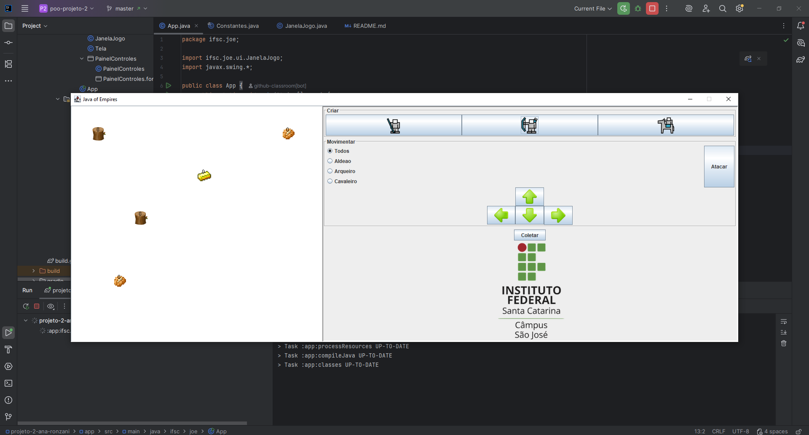

# Projeto 2: Java of Empires

Este projeto é a minha implementação para a segunda avaliação da disciplina de Programação Orientada a Objetos. O objetivo foi desenvolver um jogo de estratégia em tempo real (RTS) simples, aplicando conceitos fundamentais de POO como herança, polimorfismo e o uso de interfaces em um ambiente gráfico interativo construído com Java Swing.

## Minha Visão Sobre o Desenvolvimento

Ao desenvolver este projeto, meu foco foi criar uma arquitetura de software simples, limpa e escalável. Acredito que a base para um bom código é a organização e a clareza. Por isso, estruturei o projeto de forma a separar as responsabilidades, com pacotes distintos para a lógica de domínio (personagens, regras), a interface do usuário (telas, botões) e as enumerações.

A utilização de uma classe `Personagem` abstrata foi um pilar central, permitindo-me definir um "contrato" comum para todas as unidades do jogo. Isso simplificou a adição de novas classes como `Arqueiro` e `Cavaleiro`, que herdam o comportamento básico e implementam suas especializações através de interfaces.

## Funcionalidades Implementadas

A seguir, detalho as funcionalidades que implementei no projeto, indo além dos requisitos básicos e focando em criar uma experiência de jogo mais completa e dinâmica.

### 1. Arquitetura de Classes e Herança

Para evitar a duplicação de código e criar um modelo coeso, utilizei uma hierarquia de classes bem definida:

- **Classe Abstrata `Personagem`**: Funciona como a base para todas as unidades. Centralizei nela os atributos comuns a todos, como `vida`, `ataque`, `velocidade`, `posição (x, y)`, `alcanceAtaque` e `chanceEsquiva`. Métodos essenciais como `mover()`, `sofrerDano()` e `desenhar()` também foram implementados aqui, garantindo um comportamento padrão que pode ser herdado ou sobrescrito.

- **Classes Concretas `Arqueiro` e `Cavaleiro`**: Estas classes estendem `Personagem`, herdando todos os seus atributos e comportamentos. Elas representam as novas unidades do jogo, cada uma com seus próprios status definidos na classe `Constantes`.

- **Interfaces `Guerreiro`, `Coletador` e `ComMontaria`**: Para adicionar comportamentos específicos, optei por interfaces. Isso me permitiu aplicar uma forma de "herança múltipla de tipo".
    - `Guerreiro`: Define o contrato `atacar(Set<Personagem> alvos)`, implementado por todas as unidades de combate (`Aldeao`, `Arqueiro`, `Cavaleiro`).
    - `Coletador`: Define o contrato `coletar(Recurso recurso)`, implementado apenas pelo `Aldeao`.
    - `ComMontaria`: É uma interface de marcação, aplicada ao `Cavaleiro`, que permite identificá-lo para futuras implementações, como bônus de velocidade.

### 2. Sistema de Combate Abrangente

O sistema de combate foi projetado para ser dinâmico e estratégico, incorporando várias mecânicas.

- **Ataque em Área**: Ao acionar o botão "Atacar", cada personagem do tipo `Guerreiro` ataca simultaneamente todos os inimigos que estão dentro do seu raio de ação. Isso cria um combate mais fluido e realista para um RTS.

- **Alcance de Ataque Individual**: Cada tipo de personagem possui um `alcanceAtaque` distinto, centralizado na classe `Constantes`. O `Arqueiro` tem o maior alcance (150px), o `Cavaleiro` um alcance intermediário (75px) e o `Aldeao` um alcance curto (50px). A lógica de ataque verifica a distância euclidiana entre o atacante e o alvo antes de aplicar o dano.

- **Mecânica de Esquiva**: Para adicionar um elemento de sorte e variedade ao combate, implementei um sistema de esquiva. Cada personagem tem um atributo `chanceEsquiva` (ex: Arqueiro tem 25%). Antes de sofrer dano, o personagem tem a chance de se esquivar completamente do ataque. Quando isso ocorre, uma mensagem "ESQUIVOU!" é exibida no terminal para feedback.

- **Gerenciamento de Morte e Placar**: Após cada rodada de ataques, o sistema verifica a vida de todos os personagens. Se a vida de um personagem for menor ou igual a zero, ele é removido da coleção de personagens ativos no jogo. Implementei um contador de baixas (`Map<Class<? extends Personagem>, Integer> baixas`) que registra quantos personagens de cada tipo foram eliminados, exibindo uma mensagem no terminal a cada baixa.

### 3. Interface Gráfica e Experiência do Usuário

Busquei criar uma interface funcional e informativa.

- **Barras de Vida Dinâmicas**: Desenvolvi um sistema de barras de vida que são desenhadas acima de cada personagem. A largura da barra é proporcional à vida atual em relação à vida máxima. Além disso, a cor da barra muda dinamicamente para fornecer um feedback visual rápido sobre o estado da unidade:
    - **Verde**: Vida entre 75% e 100%.
    - **Amarelo**: Vida entre 25% e 75%.
    - **Vermelho**: Vida abaixo de 25%.

- **Filtro de Seleção de Unidades**: Para dar ao jogador controle estratégico, implementei um sistema de filtros usando `JRadioButton`. O jogador pode escolher aplicar comandos (movimento e ataque) a:
    - **Todos**: Afeta todas as unidades.
    - **Aldeão**: Afeta apenas os Aldeões.
    - **Arqueiro**: Afeta apenas os Arqueiros.
    - **Cavaleiro**: Afeta apenas os Cavaleiros.

  Internamente, utilizei o operador `instanceof` para filtrar a coleção de personagens antes de aplicar a ação, garantindo que apenas as unidades selecionadas respondam ao comando.

### 4. Coleta de Recursos

Implementei um sistema básico de coleta de recursos para expandir a jogabilidade.

- **Recursos no Mapa**: O mapa contém recursos de `COMIDA`, `OURO` e `MADEIRA`, cada um com uma quantidade limitada.
- **Ação de Coleta**: O `Aldeao`, por ser um `Coletador`, pode executar a ação de coletar. Ao acionar o botão "Coletar", ele verifica o recurso mais próximo e, se estiver dentro do alcance, coleta uma quantidade definida. Se o recurso for `COMIDA`, o Aldeão regenera parte de sua vida, adicionando uma camada extra de estratégia.

### 5. Centralização de Configurações

Para facilitar o balanceamento e a manutenção do jogo, criei a classe `Constantes.java`. Esta classe final centraliza todos os valores "mágicos" do código, como os atributos de cada personagem (vida, ataque, velocidade, etc.), configurações da tela e parâmetros de jogabilidade. Isso permite ajustar o balanceamento do jogo de forma rápida e segura, sem a necessidade de procurar e alterar valores espalhados pelo código-fonte.

### Aluna: Ana Clara Teixeira Ronzani (solo)
#### Contato: ana.ct2006@aluno.ifsc.edu.br